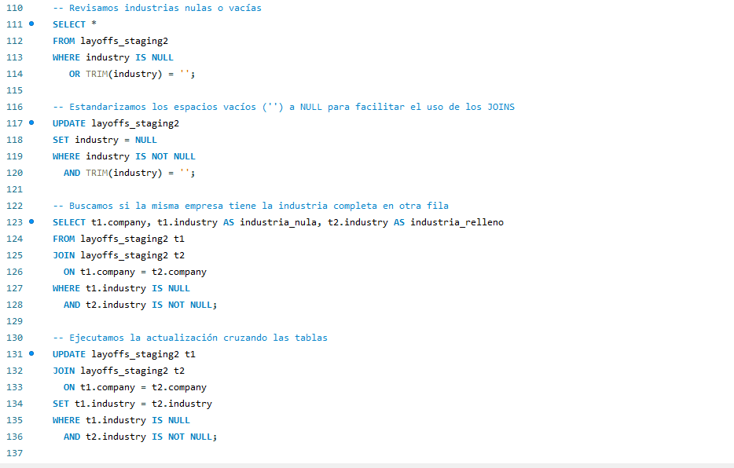

# Layoffs SQL Project
SQL — Limpieza y exploración de datos | Despidos globales (2020–2023)

## Descripción del Proyecto
Este proyecto analiza la **crisis de despidos masivos** a nivel global (2020-2023) utilizando **SQL**. 
El objetivo principal fue simular un entorno de trabajo real: tomar un dataset "sucio" y transformarlo en información útil (Insights) para la toma de decisiones.

## Herramientas Utilizadas
* **MySQL 8** (Motor de base de datos)
* **CTEs (Common Table Expressions)** (Para limpieza compleja)
* **Window Functions** (Análisis de tendencias y rankings)
* **Data Cleaning & Standardization**

## Dataset
El dataset contiene información histórica sobre despidos en empresas de distintos países e industrias.
**Variables principales:**
`company`, `location`, `industry`, `total_laid_off`, `percentage_laid_off`, `date`, `stage`, `country`, `funds_raised_millions`.

*(Fuente de datos: Kaggle / Alex The Analyst Bootcamp)*

## Limpieza de Datos (Data Cleaning)
Se aplicaron los siguientes pasos:

1. Creación de tabla staging para preservar los datos originales
2. Eliminación de duplicados usando `ROW_NUMBER()`
3. Estandarización de campos de texto (empresa, industria, país)
4. Conversión de la columna `date` al tipo DATE
5. Tratamiento de valores nulos y espacios en blanco
6. Eliminación de registros sin información útil para el análisis

## Análisis Exploratorio de Datos (EDA)
Se analizaron diferentes dimensiones del dataset:

- Despidos totales por empresa
- Despidos por industria
- Despidos por país
- Evolución temporal de despidos
- Ranking de empresas por año
- Despidos según etapa de la empresa (stage)
- Relación entre fondos recaudados y despidos

## Preguntas de análisis
El proyecto busca responder:

- ¿Qué industrias fueron más afectadas por los despidos?
- ¿Cómo evolucionaron los despidos a lo largo del tiempo?
- ¿Las empresas con mayor financiamiento despidieron menos?
- ¿Qué etapas de empresa fueron más vulnerables?

## Insights principales
Del análisis del dataset se observa que:

- El mayor volumen de despidos se concentró entre 2022 y 2023.
- La industria tecnológica presenta la mayor cantidad de despidos acumulados.
- Estados Unidos concentra la mayor cantidad de despidos en términos absolutos.
- Las empresas en etapas tempranas muestran mayores porcentajes de despidos.

## Aplicación Práctica
Como **Licenciado en Administración**, mi enfoque no es solo técnico. La metodología utilizada en este proyecto global es directamente aplicable a cualquier tipo de organizacion: 
* **Auditoría de Datos:** Limpiar bases de clientes o proveedores duplicados.
* **Análisis de Ventas:** Identificar estacionalidad (meses fuertes/bajos) y productos estrella.
* **Detección de Riesgos:** Monitorear desvíos en costos operativos o KPIs financieros.

El objetivo final es transformar información dispersa en **reportes claros para la toma de decisiones gerenciales.**

## Autor
**Ezequiel Brunet**
Licenciado en Administración | Data Analytics

[LinkedIn](https://www.linkedin.com/in/ezequielbrunet)
